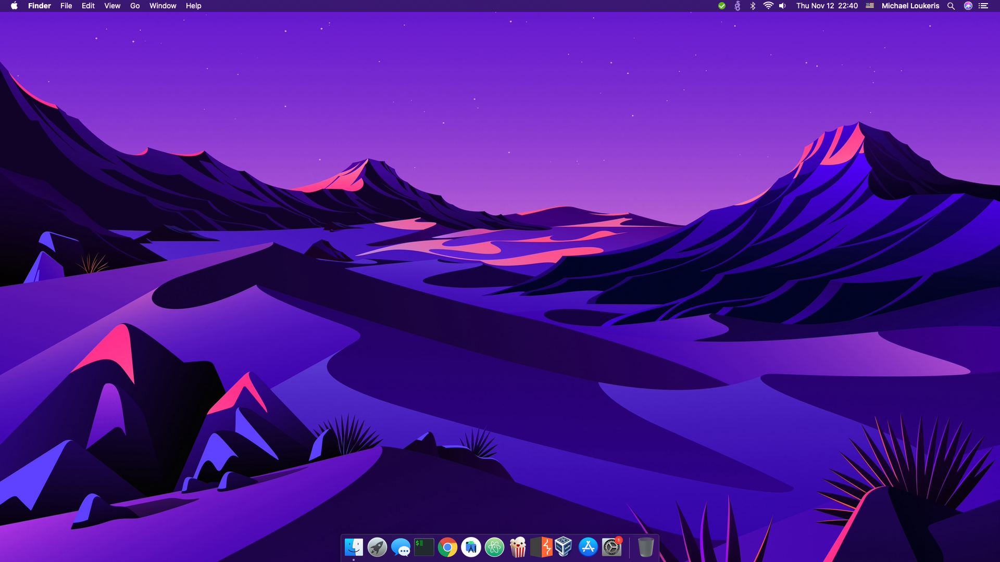

## OpenCore EFI for AMD Ryzen Hackintosh 

 

## Introduction

I am a Software Engineer and a Penetration Tester and have been using my AMD Ryzen Hackintosh with this configuration for the past year with 0 issues.

## Specification

| **Component** | **Model** |
| ------------- | --------- |
| CPU | AMD Ryzen 7 2700 @ 3.2GHz |
| Motherboard | Mortar Max B450 |
| RAM | 16GB (2 x 8GB) Crucial Ballistix @ 3200MHz |
| Audio Chipset | ALC-892 |
| GPU | RX 460 |
| WiFi & Bluetooth | BCM94331CD |
| OS Disk (NVMe) | Kingston A400 256GB |

**macOS version**: 10.15.5

**OpenCore version**: 0.6.3  

## What is working:

- Everything besides what is mentioned below

## What is not working:

- Partially-working virtualization (only VirtualBox & Parallels Dekstop 13.1.0 or below)
- Not working 3.5mm Jack microphone (only USB/Bluetooth microphones) - It can work by using VoodooHDA instead of AppleALC but you sacrifice audio quality.

## Adobe applications fix
Adobe applications crash on AMD Hackintoshes due to missing intel_fast_memset instructions.  Follow [guide](https://gist.github.com/naveenkrdy/26760ac5135deed6d0bb8902f6ceb6bd) made by XLNC to get it working!  
If Photoshop still crashes when selecting font, you have to delete `/Applications/Adobe\ Photoshop\ 2020/Adobe\ Photoshop\ 2020.app/Contents/Required/Deep_Font`

## How to use
  1. Make your USB installer with [**this guide**](https://dortania.github.io/OpenCore-Install-Guide/installer-guide/)
  2. Clone the repository and paste "BOOT" and "OC" directories into your's pendrive "EFI" folder
  3. Download [**GenSMBIOS**](https://github.com/corpnewt/GenSMBIOS) to generate unique SMBIOS information. Run it and select **Generate SMBIOS**, as the model select **iMacPro1,1**.
  4. Open config.plist with [**ProperTree**](https://github.com/corpnewt/ProperTree) and go to PlatformInfo > Generic. Set MLB (Board Serial), SystemSerialNumber (Serial) and SystemUUID (SmUUID) to generated values. Change ROM to your network card's MAC address without the `:` character. [**How to get MAC Address?**](https://www.wikihow.com/Find-the-MAC-Address-of-Your-Computer)
  5. Boot it!  

**IMPORTANT:**

- If you want iMessage and FaceTime to work, fill in YOUR info in PlatformInfo
Section.

- If you have a different MOBO then you need to adapt your USBPorts kext accordingly

## Credits

**Kexts/Resources**

 - [[Bootloader] OpenCore](https://github.com/acidanthera/OpenCorePkg)
 - [[Resources] Picker GUI](https://github.com/acidanthera/OcBinaryData/tree/master/Resources)
 - [[Patch] AMD_Vanilla](https://github.com/AMD-OSX/AMD_Vanilla)
 - [[SSDT] EC-USBX-DESKTOP](https://github.com/dortania/Getting-Started-With-ACPI/blob/master/extra-files/compiled/SSDT-EC-USBX-DESKTOP.aml)
 - [[Driver] OpenRuntime](https://github.com/acidanthera/OpenCorePkg)
 - [[Driver] OpenCanopy](https://github.com/acidanthera/OpenCorePkg)
 - [[Driver] HFSPlus](https://github.com/acidanthera/OcBinaryData/blob/master/Drivers/HfsPlus.efi)
 - [[Kext] Lilu](https://github.com/acidanthera/Lilu)
 - [[Kext] VirtualSMC](https://github.com/acidanthera/VirtualSMC)
 - [[Kext] WhateverGreen](https://github.com/acidanthera/WhateverGreen)
 - [[Kext] AppleALC](https://github.com/acidanthera/AppleALC)
 - [[Kext] RealtekRTL8111](https://github.com/Mieze/RTL8111_driver_for_OS_X)
 - [[Kext] AMDRyzenCPUPowerManagement](https://github.com/trulyspinach/SMCAMDProcessor)
 - [[Kext] SMCAMDProcessor](https://github.com/trulyspinach/SMCAMDProcessor)
 - [[Kext] AppleMCEReporterDisabler](https://github.com/AMD-OSX/AMD_Vanilla/blob/experimental-opencore/Extra/AppleMCEReporterDisabler.kext.zip)

**Guides/Support**

 - [Apple](https://apple.com) for macOS
 - [AMD-OSX Developers](https://github.com/AMD-OSX) for kernel patches for AMD CPUs
 - [Acidanthera](https://github.com/acidanthera) for OpenCore and most of used kexts
 - [Trulyspinach](https://github.com/trulyspinach) for Ryzen power management and monitoring kexts
 - [Mieze](https://github.com/Mieze) for RealtekRTL8111 kext
 - [Dortania](https://github.com/dortania) for OpenCore configuration guides
 - [XLNC](https://github.com/naveenkrdy) for Adobe patches for AMD CPUs
 - [AMD-OSX Community](https://amd-osx.com) for support while making my Hackintosh

If you have any questions, please open an issue :)

Cheers!
